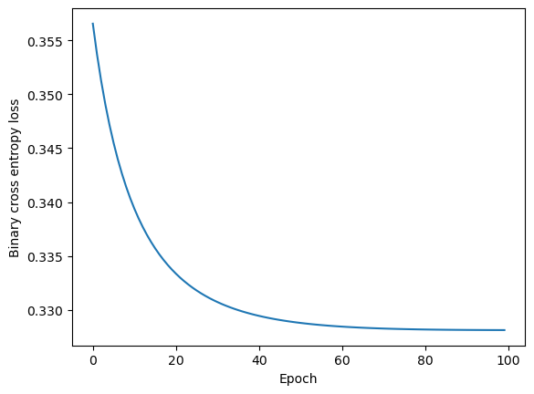

# Classifying active and inactive androgen receptior-binding PFAS with RDKit and PyTorch

## Background

Per- or poly-fluoroalkyl substances, PFAS, are a group of industrial "forever chemicals" associated with ecological and human health hazards.
Characterized by fluorinated alkyl chains and a polar head groups, these surfactant-like molecules are known to affect the functioning of androgen receptors (ARs), which play pivotal roles in human development and physiology.

## The Dataset
A curated list of PFAS molecules known to have active (agonistic or antagonistic) or inactive effects on androgen receptors in human-relevant *in vitro* assays developed by [Singam *et al.*, 2020](https://doi.org/10.1016/j.envres.2020.109920) based on data from U.S. federal government program, [Tox21](https://tox21.gov/tox21-library/).
Eachentry of the dataset contains three bits of information:
* SMILES fingerprint of the molecule
* Name, i.e., PubChem SID of the molecule
* Label, i.e., whether the molecule has "Active" or "Inactive" effects on AR

See `source_dataset/Curated_AR_TOX21_Dataset.smi`

## Overarching Goal

Train a binary classifier using PyTorch that will label a molecule "Active" or "Inactive" based on its functional groups.

## General Approach
Develop features for molecules based on their SMILES fingerprints. 
Test different sets of descriptors for predictive power.

## H1: Molecule activity is determined by Lipinski's rules of 5.
See `h1_lipinski/`.
A simple perceptron model with four features was built. 
The accuracy converged at 88.3%, anf the loss function converged around 60-70 epochs.

#### Ideas for further testing

What's important for binding? (from chemical intuition)
 - hydrophobicity
 - hydrogen bonding ability
 - charge
 - radius of gyration
 - felxibility
 - rings
 - saturation of bonds

